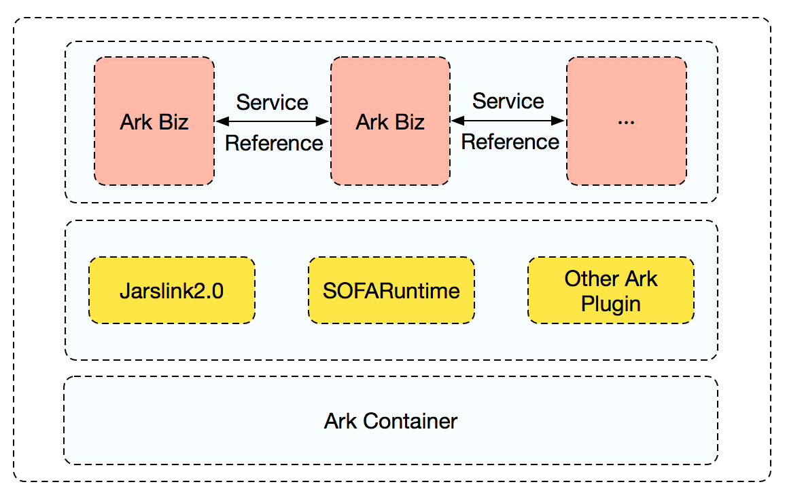

# Introduction
Jarslink2.0 is a functional [SOFABoot](https://github.com/sofastack/sofa-boot) plugin developed based on [SOFAArk](https://github.com/sofastack/sofa-ark). It manages the merged deployment of multiple applications on top of the SOFAArk container, with the following features:

+ It supports runtime dynamic installation and uninstallation of applications.

+ It supports runtime application hot replacement capability to ensure service continuity.

+ For cross-application communication, it supports the JVM services publish and reference. Cross-application communication can base on RPC framework or internal JVM services.

+ It supports application Health Check.


## Background
At Ant Financial, it is common to deploy multiple applications on top of the same JVM. Main advantages of this approach are as follows:

+ Merged deployment of unrelated applications: Some applications have no service dependencies on each other when they are deployed independently and their volume of business is small, so it would be a waste of resources to start the Java Virtual Machine just for them. Merged deployment of these applications can save resources.

+ Merged deployment of related applications: Some applications have service dependencies between them. When deployed independently, RPC calls are used between applications. Despite the high stability of the distributed architecture, there are still delays caused by network jitter. By merged deployment of these applications, JVM internal calls will replace RPC calls, which reduces the call overhead.

Not only is there merged deployment between applications, but the near-client package has the same appeal.

The near-client package is a three-party component that provides a series of public services, normally introduced by the application as a dependency. This development mode is likely to cause two problems:

+ The three-party dependency that is introduced by the near-client package conflicts with the dependency of the application itself, so an isolated deployment is expected.

+ Since the near-client package is introduced by the application as a dependency, any upgrade of the near-client package will require upgrade of the application as well. However, as a common functional component, many business applications rely on the near-client package as a dependency, which entails a huge amount of transformation. Consequently, a dynamic upgrade of the near-client package is expected.

In addition to merged deployment, many Ant Financial business scenarios require hot deployment of modules, that is, when the application is running, a specific module needs to be dynamically replaced without affecting the normal running of other modules.

Jarslink2.0 is designed to solve such problems. It is an Ark Plugin developed based on SOFAArk and used to manage the merged deployment of multiple applications. Before getting to know Jarslink2.0, you need to understand the SOFAArk framework. For detailed information of SOFAArk, visit the [link](../sofa-ark/readme).

## Principle
Jarslink2.0 is an [Ark Plugin](../sofa-ark/ark-plugin) developed based on SOFAArk. Assuming that you have certain knowledge of SOFAArk, you must know that the application is packaged into an [Ark Biz](../sofa-ark/ark-biz) package to run on top of the SOFAArk container. SOFABoot or Spring Boot applications and even common modules can be packaged into a standard Ark Biz package with the SOFAArk plugin.

Jarslink2.0 supports multiple Ark Biz packages running on top of the SOFAArk container to achieve merged deployment of multiple applications. The applications can quickly publish services or reference services published by other applications in the form of annotations to achieve intercommunication. The following is the structure chart of multi-application merged deployment at runtime:

 

As you can see from the chart, the use of Jarslink2.0 usually requires the introduction of two Ark Plugins, and we will describe their roles.

+ Jarslink: core code of Jarslink2.0, supports dynamically receiving commands such as installation, uninstallation, and switching. It is used to manage the life cycle of Ark Biz. If you need to dynamically deploy applications at runtime, you need to add the following dependency:
```xml
<dependency>
    <groupId>com.alipay.sofa</groupId>
    <artifactId>sofa-jarslink-ark-starter</artifactId>
    <classifier>ark-plugin</classifier>
</dependency>
```
+ SOFARuntime: As a functional module provided by SOFABoot, SOFARuntime is used to implement cross-application service calls. If you need to use cross-application calls, you need to add the following dependency:
```xml
<dependency>
    <groupId>com.alipay.sofa</groupId>
    <artifactId>runtime-sofa-boot-starter</artifactId>
</dependency>
<dependency>
    <groupId>com.alipay.sofa</groupId>
    <artifactId>runtime-sofa-boot-starter</artifactId>
    <classifier>ark-plugin</classifier>
</dependency>
```


